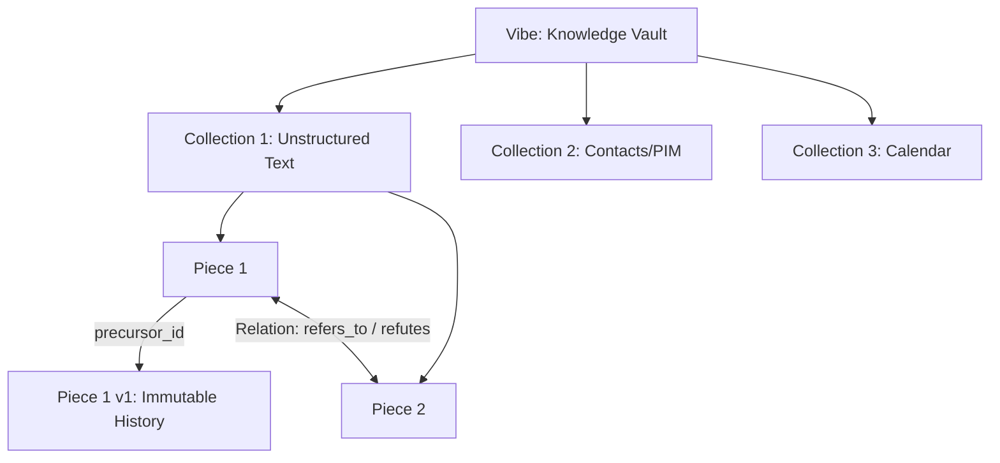

# vibeNote: Project Specification & Architecture Considerations

vibeNote is a local-first, privacy-respecting personal knowledge management (PKM) tool inspired by Notion and Obsidian. Unlike traditional notes applications that rely on rigid folder hierarchies or manual linking, vibeNote leverages local AI-driven vector proximity search (RAG) and structured semantic relationships to organize and retrieve knowledge dynamically.

---

## 1. Core Vision & Concepts

vibeNote rejects hierarchy. Concepts in human memory are not nested in directories; they are linked by association and retrieved by relevance. vibeNote mirrors this by treating notes as a flat pool of semantically searchable fragments that can form dynamic collections and explicit relation graphs.

### Key Terms



1. **Vibe (Vibes)**
   * **Definition:** The top-level workspace or database container, equivalent to an Obsidian Vault.
   * **Scope:** A Vibe encapsulates all notes, vector stores, schemas, local configurations, and indexing models. Vibes are completely self-contained and isolated from each other.

2. **Collection**
   * **Definition:** A logical dataset within a Vibe.
   * **Types:**
     * **Unstructured Text:** Standard markdown notes, web clippings, or code snippets.
     * **Calendar (Future):** Event data with temporal mapping and synchronization options (e.g., CalDAV, Google Calendar).
     * **Contacts (PIM - Personal Information Manager):** Structured profile data for people, organizations, or entities.

3. **Piece**
   * **Definition:** The atomic unit of data/entry in a collection (e.g., a paragraph, a calendar event, a contact card).
   * **Token Limit Constraints:** Pieces have a hard limit on token count to ensure efficient vector search indexing and perfect LLM context-window insertion. This limit excludes metadata.
   * **Immutability:** Pieces are strictly immutable. Once written, a Piece cannot be edited.
     * **Correction/Update Workflow:** If a Piece contains outdated or incorrect information, it is tombstoned (marked as deleted/inactive) and a new Piece is created.
     * **Incremental Additions:** If new information is added, a new Piece is created with a timestamp and a relation link pointing back to the existing Piece.
   * **Relations:** Pieces can have typed, bidirectional relationships with other Pieces (e.g., `refers_to`, `contradicts`, `supports`, `part_of`).

---

## 2. Architectural Design Considerations

To build vibeNote as a premium, local-first note-taking tool, several architectural decisions must be resolved regarding storage, RAG pipelines, versioning, and MCP integration.

### A. Storage Architecture: Local-First Dual-Database & Physical Filesystem
Because vibeNote has complex relational requirements (relations, metadata, collections) as well as vector proximity needs, a **hybrid storage model** is implemented.

```
+-------------------------------------------------------------+
|                        vibeNote Client                      |
+-------------------------------------------------------------+
                               |
                               v
+-------------------------------------------------------------+
|                      Local Storage Engine                   |
+---------------+---------------+-----------------------------+
                |               |                             |
                v               v                             v
+-----------------------+ +---------------+     +-----------------------+
|  Physical Filesystem  | |   SQLite DB   |     |    Vector Index       |
| (Raw notes, vCards,   | |  (Metadata,   |     |     (USearch HNSW)    |
|      iCal events)     | | Relations, Log) |     |                       |
+-----------------------+ +---------------+     +-----------------------+
```

1. **Physical Filesystem (The Raw Content Store)**
   * **Structure:** Piece contents are stored as human-readable raw files under flat directories inside the Vibe's directory hierarchy:
     * *Plain Text pieces:* `.md` or `.txt` files.
     * *Contacts (PIM) pieces:* `.vcf` (vCard) files.
     * *Calendar Event pieces:* `.ics` (iCal/vCal) files.
     * *Path template:* `<vibe_path>/<collection_folder>/<piece_id>.<extension>`
   * **Structured Collection Ingestion & Vectorization Workflow:**
     For pieces in collections of type `contacts` or `calendar`, the data is accepted via the MCP tools and UI as a structured JSON object. The Rust backend handles ingestion as follows:
     1. **Storage:** The JSON payload is serialized and written to disk as a standard `.vcf` or `.ics` file.
     2. **Vectorization:** The backend converts the structured JSON representation into natural language text descriptive format (e.g. *"Contact profile for John Doe, Email: john@example.com, Phone: +123456789. Department: Engineering."*) optimized for semantic embedding.
     3. **Indexing:** The natural language string is vectorized by the embedding engine and stored in the vector index.
     4. **Metadata Extraction:** Core metadata attributes are extracted from the JSON and stored as structured columns in the SQLite database to facilitate fast relational queries and filters.
   * **No Nested Collections:** Subdirectories under a Vibe cannot be nested. Multi-group separation is achieved by creating multiple distinct collection folders at the same root level (e.g. `<vibe_path>/contacts_work/` and `<vibe_path>/contacts_personal/`).

2. **SQLite (The Relational Core & Event Log)**
   * **Role:** Stores metadata, Piece lifecycle events, collections, relations, and index mapping.
   * **Schema Design:**
     * `collections`: `id` (UUID/text), `name`, `type` (`text` | `contacts` | `calendar`), `folder_path`.
     * `pieces`: `id` (UUID), `collection_id`, `uri`, `created_at`, `is_active` (boolean).
     * `piece_history`: `parent_piece_id`, `child_piece_id`, `change_type` (`replacement` | `extension`), `timestamp`.
     * `relations`: `source_piece_id`, `target_piece_id`, `relation_type` (text), `created_at`.
   * **Why SQLite?** Zero setup, fast, transactional, and runs directly inside the Tauri Rust core using the synchronous **`rusqlite`** crate.

3. **Vector Database / Index (USearch HNSW)**
   * **Role:** Stores high-dimensional vector embeddings for fast similarity search.
   * **Decision:** vibeNote uses **USearch** as its vector backend, utilizing HNSW graphs loaded into memory or mapped from disk via memory mapping (`view=True`).
   * **Write-Through Synchronization Sequence:**
     To maintain consistency between SQLite metadata and the vector index:
     1. Open a SQLite transaction and write the metadata and historical changes.
     2. Update the USearch graph in memory (adding or removing the Piece's vector).
     3. Serialize the index back to `<vibe_path>/vibe.usearch` via `index.save()`.
     4. If serialization succeeds, commit the SQLite transaction. If it fails, roll back the transaction.
   * **Capacity Constraints:**
     * The USearch HNSW graph is initialized with a **large static capacity limit of 100,000 vectors** per Vibe.
     * *Future Defragmentation:* When the index reaches 70–80% of its capacity, the system should trigger a defragmentation process to clean deleted nodes, optimizing memory usage and graph density before reaching limits.
   * **Scaling Limits & Optimization:**
     * Runs natively in Rust via C++ bindings with SIMD acceleration.
     * Requires roughly ~2GB of RAM for 1,000,000 vectors of 384-dimensions.
     * To fit consumer hardware footprints, the index will utilize SSD-backed memory-mapping and vector quantization (e.g. `int8` or `float16`).

---

### B. Immutability & Event-Log Architecture
To ensure Pieces are immutable and changes are trackable, we implement an **append-only architecture**:

* **Creation:** A new Piece gets inserted into SQLite with an active state (`is_active = 1`).
* **Editing (Replacement):**
  1. The existing Piece's `is_active` status is set to `0`.
  2. A new Piece is inserted with the corrected content.
  3. A record is added to the `piece_history` table:
     ```sql
     INSERT INTO piece_history (parent_piece_id, child_piece_id, change_type) 
     VALUES (old_piece_id, new_piece_id, 'replacement');
     ```
* **Extending (Appending Info):**
  1. The original Piece remains active (`is_active = 1`).
  2. A new Piece is created with the new/complementary information.
  3. A relation link (`extension_of`) is forged between the new Piece and the original Piece, logging the timestamp of the new insight.

**Advantages:**
* Full time-travel capability: Users can query the state of their Vibe at any point in history.
* LLMs can trace the reasoning or update chain over time ("How did my thoughts on X evolve?").

---

### C. Local AI & Embedding Pipeline (RAG)
To make vector search private and fast, vibeNote runs the embedding pipeline entirely on the user's machine.

```
User inputs text/edit -> Chunking/Token counting -> Local Embedding Model -> Vector DB
                                                                  ^
                                                       Ollama or Transformers.js
```

1. **Embedding Generation:**
   * **Model Selection (Multilingual Support):** Because note collections are heterogeneous in terms of language (e.g., a single collection can contain English, Polish, German, and Spanish notes mixed together), a **cross-lingual multilingual embedding model** is required.
     * **Recommended Local Models:** `BGE-M3` (which supports dense, sparse, and multi-vector retrieval across 100+ languages natively), `multilingual-e5-large`/`multilingual-e5-base`, or `nomic-embed-text-v1.5` (via its multilingual capacity).
     * **How it helps:** Cross-lingual models project different languages into a shared semantic vector space. This allows a user to write a search query in English and successfully retrieve matching pieces written in German or Spanish.
   * **Engine:** 
     * **In-Process ONNX Runtime (`ort` crate):** Executes the embedding model natively inside the Rust backend thread. This provides a zero-dependency, self-contained embedding flow without needing external HTTP dependencies (like Ollama).
     * **Weights Bundling:** The model weights (e.g., standard multilingual sentence transformer) are bundled directly inside the Tauri binary using Rust's **`include_bytes!`** macro. This ensures that vibeNote functions entirely offline on first startup without requiring an initial download or setup steps.
     * **Ollama API (Optional integration):** Provided as an alternative option in configuration settings if users want to delegate embedding extraction to a central Ollama host.

2. **Vector Retrieval & Prompt Construction:**
   * A search query is embedded using the same model.
   * Cosine similarity is computed against the Vector DB.
   * The top $K$ pieces are retrieved.
   * Relational check: If retrieved Piece $P$ is a replacement/extended version, follow the relation chain to resolve the most active or contextually complete set of Pieces.

---

### D. Model Context Protocol (MCP) Integration
One of vibeNote's primary differentiators is exposing its database and RAG engine as an MCP Server. This allows local AI agents (such as Jan.ai, Claude Desktop, Cursor, or LibreChat) to use vibeNote as a plugin tool.

#### Execution & Communication Channel Mode:
* **Background SSE Server:** Spawns an SSE listener on a loopback port in the background when running in standard GUI mode.
* **CLI Stdio Pipe (`--mcp`):** Exposes the MCP server over terminal stdio. Spawning via `--mcp` runs vibeNote in **Tray-Minimized Hybrid Mode**, where the app window is minimized directly to the system tray while processing the stdio stream. This prevents spawning unwanted windows inside IDE workflows, while allowing the user to restore the GUI to view active agent query logs.

#### Exposed MCP Tools:
* `search_vibe(query: string, limit?: number)`: Runs a semantic RAG query across all active Pieces in a Vibe.
* `search_collection(query: string, collection_id: string, limit?: number)`: Performs a semantic RAG query filtered by a specific collection (Collection ID).
* `get_piece_details(id: string)`: Retrieves a specific Piece, its full metadata, history, and relations.
* `create_piece(content: string, collection_id: string, metadata?: object)`: Adds a new Piece to a Collection.
* `link_pieces(source_id: string, target_id: string, relation_type: string)`: Explicitly creates a semantic connection between two items.
* `get_relations_graph(piece_id: string)`: Returns the local network of related Pieces.
* `list_collections()`: Returns a list of all collections (UUID, name, type, and folder path) in the current Vibe.
* `set_metadata(piece_id: string, key: string, value: string)`: Sets a specific metadata key-value pair for a Piece.
* `delete_metadata(piece_id: string, key: string)`: Deletes a specific metadata key for a Piece.

---

## 3. Recommended Technology Stack

| Layer | Chosen Technology | Rationale |
| :--- | :--- | :--- |
| **Frontend UI** | **React / Svelte / Vue (in HTML/TS)** | Runs inside the Tauri system webview. Keeps frontend logic dynamic and visually premium. |
| **App Shell & Backend** | **Tauri (Rust Core)** | Extremely lightweight system wrapper, handles native system-tray, configuration, and file access. |
| **Database (Relational)** | **SQLite (via `rusqlite` crate)** | Direct synchronous C-bindings to SQLite; lightweight, fast, and simple to structure inside Tauri state. |
| **Database (Vector)** | **USearch (via `usearch` Rust crate)** | High-speed C++ HNSW graph bindings for Rust. Serializes index directly to `<vibe_path>/vibe.usearch`. |
| **Local AI Embeddings** | **In-process ONNX (`ort` crate)** | Native cross-platform execution of cross-lingual embedding models (like BGE-M3 or MiniLM) without local process dependencies. |
| **MCP Implementation** | **Hybrid SSE and Stdio CLI Router** | SSE server for background connections when the GUI is running, and a stdio-based CLI option (`--mcp`) for direct IDE integration. |

---

## 4. Key Engineering Challenges & Proposed Solutions

1. **Token Counting & Ingestion Validation:** 
   * **Two-Step Ingestion Validation:**
     1. *Fail-Fast Character Limit:* During Piece creation or update, the system first runs a fast character length check against a configurable threshold (default: 2,000 characters, representing roughly under 800 tokens). If this limit is exceeded, the request is immediately rejected. This threshold is configurable per Application Instance.
     2. *Precise Token Limit:* If the character check passes, the text is evaluated by the local embedding model's tokenizer. If the precise token count exceeds the Vibe's configured limit (default: 800 tokens), it is rejected.
   
2. **Syncing Calendar & PIM Data:** 
   Parsing calendar (iCal/vCal) or contacts (vCard) into granular "Pieces" while maintaining update logs will require schema adapters. For example, a single Event has a description, start time, end time, and attendees. If an event is updated, we replace the Event Piece.

3. **Context Window Assembly (RAG Stitching):** 
   When an external LLM asks a question, how do we stitch together the retrieved Pieces? Since Pieces are small, we need an algorithm to combine nearby or highly-related Pieces (following the graph relations) to present a coherent context blocks instead of isolated sentences.
   * *Proposed Solution (Graph-Aware Hybrid Context Assembly):*
     1. **Retrieve Initial Seed Pieces:** Run vector search to find the top $K$ pieces matching the query's embedding.
     2. **Expand via Relations (Graph Walking):** For each seed piece, look up its immediate neighbors (1-degree connections) in the SQLite relations table that are active.
     3. **Resolve Versions:** If any seed or neighbor has a newer replacement version (determined by traversing `piece_history` where `change_type = 'replacement'`), automatically fetch the newest version. If it's an extension, fetch the chain of extension pieces in chronological order.
     4. **Greedy Token Budget Packing:** Pack the pieces into the context starting with the seed pieces, then their direct neighbors, until the local token counter approaches the designated context budget (e.g. 4000 tokens).
     5. **Context Formatting:** Format each piece clearly for the LLM:
        ```text
        [Piece ID: uuid] [Collection: text-collection] [Created: timestamp]
        Content: <Piece Text>
        ---
        ```
        This formatting allows the LLM to understand temporal evolution and explicit relations directly from the structured context.
